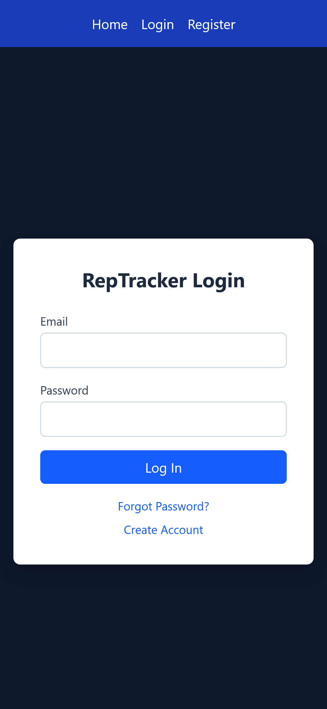
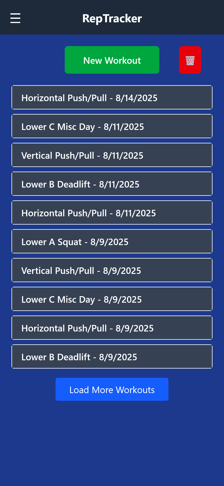
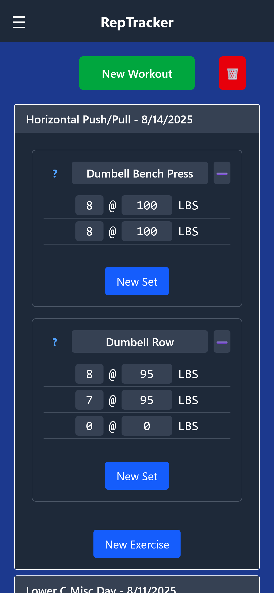
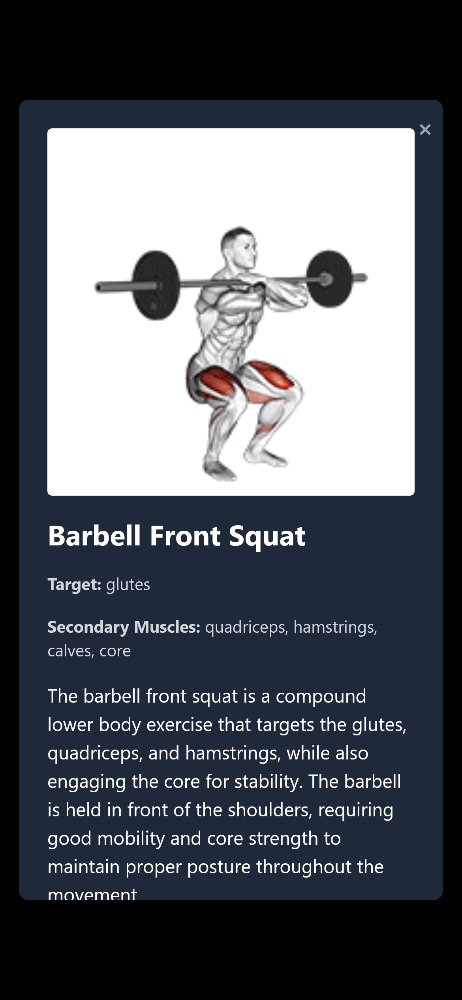
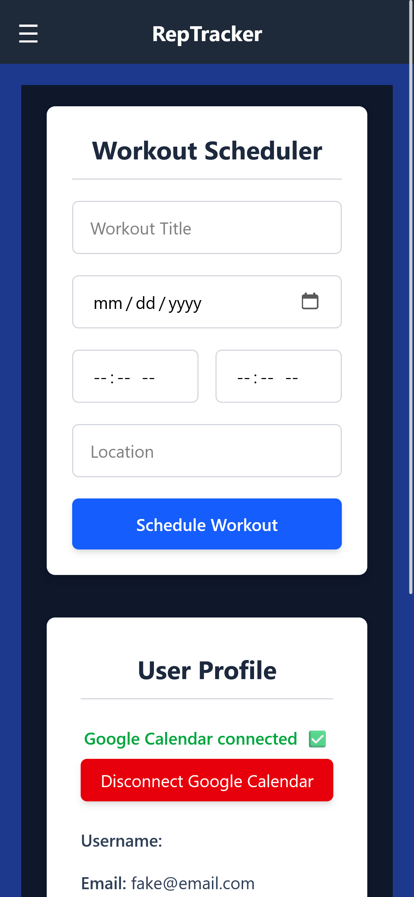
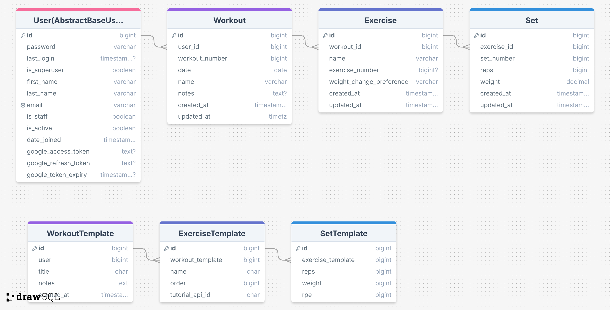

# RepTracker

> **Note:** This project is for portfolio and educational purposes only. It is not licensed for reuse or distribution.

RepTracker is a full-stack workout tracker app that allows users to log workouts, track exercises, sets, reps, and weights, and visualize *progress over time (under construction)*. The app integrates with Google Calendar and ExerciseDB API to enhance workout planning and tracking.

## Table of Contents

- [Features](#features)
- [Tech Stack](#tech-stack)
- [Database Schema](#database-schema)
- [Setup & Installation](#setup--installation)
- [Usage](#usage)
- [Testing](#testing)
- [Contributing](#contributing)
- [License](#license)

## Features

- User registration, login, and profile management  
- Create and log workouts, exercises, and sets  
- Track reps, weights, and workout history  
- Weight change preference for exercises (increase, decrease, maintain)  
- Integration with Google Calendar (to schedule workouts from the app) and ExerciseDB API (to get info/tutorials on specific exercises)
- Cookie-based JWT authentication  
- Dashboard for quick overview of progress  

## Usage

- Log in or register a new account  

- Create a new workout and add exercises  

- Add sets with reps and weight for each exercise 
 
- Get exercise info, animated demonstrations, and instructions via ExerciseDB API call
 
- Sync workouts to Google Calendar  
 

## Tech Stack

- **Frontend:** React, Vite, Tailwind CSS  
- **Backend:** Django, Django REST Framework  
- **Database:** PostgreSQL
- **Authentication:** JWT, Google OAuth2 integration  
- **Testing:** pytest, pytest-django  
- **Development Tools:** Python Decouple, django-sslserver  

## Database Schema


*Note templates aren't currently implemented.*

**Relationships Overview:**  
- Users have many Workouts  
- Workouts have many Exercises  
- Exercises have many Sets  

## Setup & Installation

1. Clone the repository:  
```
git clone https://github.com/YOURUSERNAME/RepTrack.git
```
## Backend Setup
2. Navigate to the backend directory:  
```
cd RepTracker/backend
```
3. Create a virtual environment:  
```
python -m venv venv
```
4. Activate the virtual environment:  
- Windows: `venv\Scripts\activate`  
- Mac/Linux: `source venv/bin/activate`
5. Install dependencies:  
```
pip install -r requirements.txt
```
6. Apply database migrations:  
```
python manage.py migrate
```
7. Create a superuser:  
```
python manage.py createsuperuser
```
8. Run the development server:  
```
python manage.py runserver
```
## Frontend Setup
9. Navigate to the frontend directory:  
```
cd RepTracker/frontend
```
10. Install dependencies:  
```
npm install
```
11. Run the development server:  
```
npm run dev
```
12. Open your browser at the URL shown in the terminal (usually http://localhost:5173) to view the app.

## Testing

Run backend tests:  
```
pytest
```

For frontend tests (if implemented), follow the frontend testing instructions in the frontend directory.

## Contributing

This project is for portfolio and educational purposes only.  
It is **not open for external contributions**. Any use, copying, or distribution of the code requires explicit permission from the author.

## License

This project is **not licensed** and is provided for **portfolio and educational purposes only**.  
All rights are reserved by the author. No part of this project may be reused, copied, or distributed without explicit permission.

# Testing CI/CD test 3 - maybe?? correctdir-dns-venv
